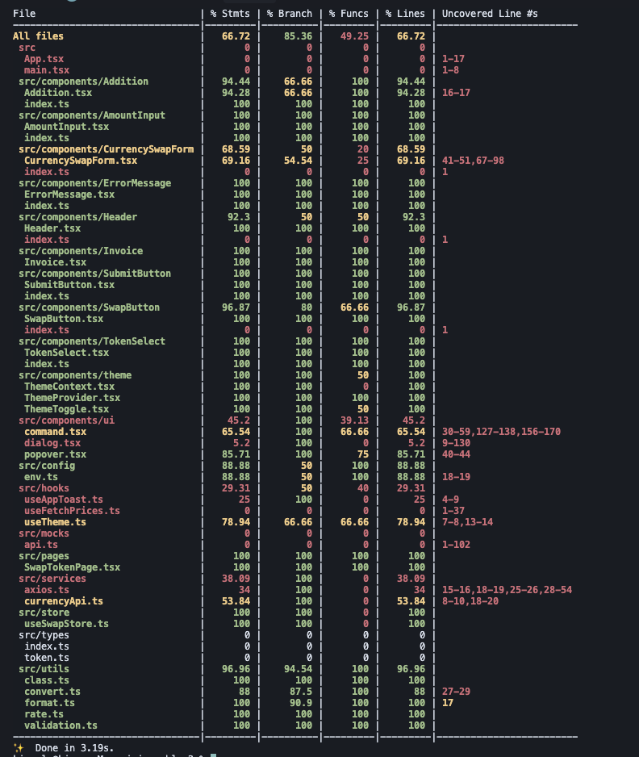
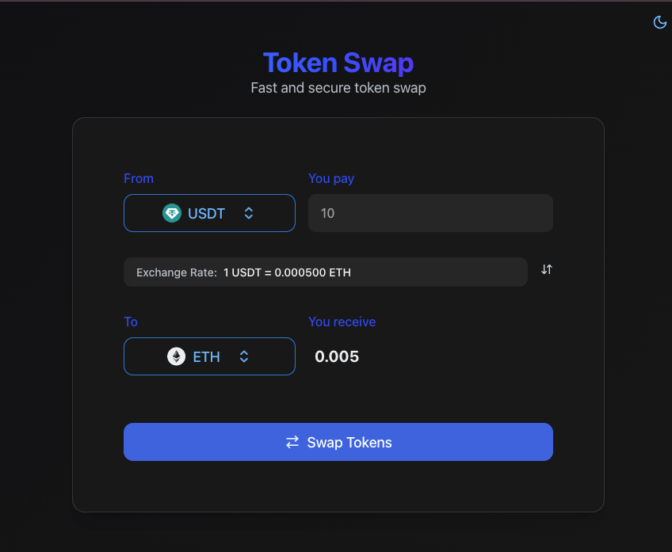

# Currency Swap Form

## Project Overview - VERY IMPORTANT

### This project demonstrates a comprehensive implementation of a currency swap form, intentionally designed with scalability and maintainability in mind. 

### While a simpler implementation could have sufficed, this version showcases advanced architectural patterns and best practices to highlight the importance of proper project structure and maintainable code.

### 📊 Test Coverage


### 🖼️ Project Screenshot


## Project Structure

```
src/
├── assets/         # Static assets (images, fonts, etc.)
├── components/     # Reusable UI components
├── config/         # Configuration files
├── hooks/          # Custom React hooks
├── mocks/          # Mock server and test data
├── pages/          # Page components
├── services/       # API services and data fetching
├── store/          # Zustand store and state management
├── types/          # TypeScript type definitions
├── utils/          # Utility functions
└── __tests__/      # Test files
```

## Tech Stack

### Core Technologies
- **React 19** - Latest version of React for building user interfaces with type safety and modern features
- **TypeScript** - For type-safe code and better developer experience
- **Vite** - Next-generation frontend tooling offering extremely fast development server and build times
- **TailwindCSS** - Utility-first CSS framework enabling rapid UI development with utility classes

### State Management & Data Fetching
- **Zustand** - Lightweight state management without boilerplate
- **Axios** - Promise-based HTTP client
- **React Hook Form** - Efficient form handling with built-in validation

### UI Components & Styling
- **Radix UI** - Unstyled, accessible components
- **Lucide React** - Beautiful icons
- **Sonner** - Toast notifications
- **Tailwind Merge** - Utility for merging Tailwind classes

### Testing
- **Jest** - Testing framework
- **React Testing Library** - Testing utilities for React
- **Axios Mock Adapter** - Mocking HTTP requests in tests
- **Jest Coverage** - Code coverage reporting and analysis

## Installation

1. Clone the repository:
```bash
git clone [repository-url]
cd currency-swap-form
```

2. Install dependencies:
```bash
yarn install
```

3. Set up environment variables:
```bash
cp .env.example .env
```
Edit the `.env` file with your configuration.

## Configuration

### Mock Server Setup

The project includes a mock server for development and testing. The mock server is configured in the `src/mocks` directory.

To use the mock server:
1. Ensure you have the correct environment variables set in `.env`
2. The mock server will automatically intercept API calls in development mode

## Development

To start the development server:
```bash
yarn dev
```

The application will be available at `http://localhost:5173`

## Building for Production

To create a production build:
```bash
yarn build
```

To preview the production build:
```bash
yarn preview
```

## Testing

Run tests:
```bash
yarn test
```

Run test with coverage report:
```bash
yarn coverage
```


The coverage report will be available at `coverage/index.html` after running the coverage command. It includes:
- Statement coverage
- Branch coverage
- Function coverage
- Line coverage

## Code Quality

The project uses ESLint for code linting:
```bash
yarn lint
```

## Build container
```bash
# Build the production container
docker build -t currency-swap-form-prod -f Dockerfile .

# Run the production container
docker run -p 80:80 currency-swap-form-prod
```